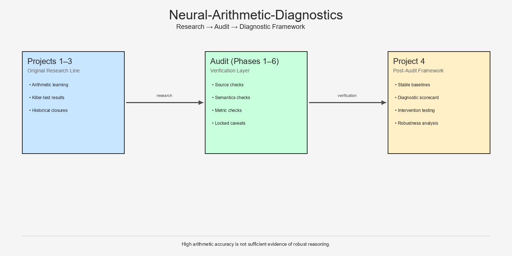

# Neural-Arithmetic-Diagnostics
## From Arithmetic Performance to Robustness, Mechanism, and Failure Structure

**A research repository on arithmetic reasoning in neural networks, including historical projects, a full trust-recovery audit, a diagnostic framework, decomposition research, mechanistic interpretability, and local-to-global failure analysis.**

---

## Why this repository matters

Neural models can achieve high arithmetic accuracy and still fail in structured, surprising, and scientifically important ways.

This repository matters because it does not stop at:
- high benchmark scores
- or shallow interpretations of success

Instead, it documents a full research arc that moved through:

- **Projects 1–3:** original arithmetic-learning research
- **A full trust-recovery audit:** to determine what was actually supported
- **Project 4:** a diagnostic framework for distinguishing narrow gains from broader structural robustness
- **Project 5:** decomposition robustness exploration
- **Project 6:** mechanistic interpretability sandbox
- **Project 7:** local-to-global failure bridge analysis

### Core message
> **High arithmetic accuracy alone is not sufficient evidence of robust reasoning.**

That remains the central lesson of the repository.

### Start here if you want the human reason this project matters
- [`WHY_THIS_PROJECT_MATTERS.md`](WHY_THIS_PROJECT_MATTERS.md)

### Start here if you want the fastest technical entry
- [`GETTING_STARTED_FAST.md`](GETTING_STARTED_FAST.md)

---



---

## What makes this repository different

This is not just:
- a code dump
- a benchmark repository
- or a sequence of disconnected experiments

It contains:

- a **historical research line** (Projects 1–3)
- a **verification archive** (the audit)
- a **post-audit diagnostic framework** (Project 4)
- a **decomposition research branch** (Project 5)
- a **mechanistic interpretability branch** (Project 6)
- a **local-to-global bridge branch** (Project 7)

In other words, it preserves both:
- scientific results
- and the process by which those results were tested, corrected, and deepened

---

## Key result in one paragraph

Across the research line, strong arithmetic performance on standard/random tests repeatedly turned out to be insufficient for strong reasoning claims. Structured adversarial tests revealed hidden weaknesses, the audit locked important caveats, Project 4 introduced a framework for distinguishing narrow gains from broader structural robustness, Project 5 showed that decomposition can work in principle while learned decomposition fails selectively, Project 6 demonstrated that arithmetic-relevant internal structure is real and mechanistically meaningful, and Project 7 showed that local-to-global compositional failure is not driven by one uniform mechanism. The repository now supports a much stronger position than a single benchmark result: arithmetic behavior must be evaluated behaviorally, structurally, and mechanistically.

---

## Repository at a glance

```text
neural_arithmetic_diagnostics/
├── src/               # Core executable project code
├── papers/            # Historical research line (Projects 1–3)
├── final_audit/       # Trust-recovery verification archive
├── project_4/         # Diagnostic arithmetic reasoning
├── project_5/         # Decomposition robustness exploration
├── project_6/         # Mechanistic interpretability sandbox
├── project_7/         # Local-to-global failure bridge
├── tests/             # Test files
├── checkpoints/       # Original checkpoints
└── README.md
```

---

## The main layers of the repository

### 1) Projects 1–3 — Historical research line
Located in:
- [`papers/`](papers/)

This is where you find:
- original project closures
- historical findings
- killer-test narratives
- final research-facing interpretations

**Start here:**  
- [`papers/README.md`](papers/README.md)

---

### 2) Audit — Verification archive
Located in:
- [`final_audit/`](final_audit/)

This is where the project's trust was rebuilt after a critical model/source mismatch problem.

It contains:
- executive summaries
- phase closure summaries
- verification scripts
- bounded reproduction outputs
- locked caveats

**Start here:**  
- [`final_audit/README.md`](final_audit/README.md)

---

### 3) Project 4 — Diagnostic Arithmetic Reasoning
Located in:
- [`project_4/`](project_4/)

This project established the post-audit diagnostic framework:
- regimes
- scorecard
- stable baseline matrix
- intervention-based narrow-vs-transfer distinction

**Start here:**  
- [`project_4/README.md`](project_4/README.md)

---

### 4) Project 5 — Decomposition Robustness Exploration
Located in:
- [`project_5/`](project_5/)

This branch asks:
- can decomposition improve structural robustness?
- where does learned local decomposition fail?
- what explanations can be ruled out?

**Current status:** OPEN / PAUSED at strong checkpoint

---

### 5) Project 6 — Mechanistic Interpretability Sandbox
Located in:
- [`project_6/`](project_6/)

This branch investigates:
- where carry lives internally
- how success and failure differ internally
- which units and subspaces matter causally
- and how arithmetic structure appears in hidden geometry

**Current status:** COMPLETE with strong mechanistic success

---

### 6) Project 7 — From Local Competence to Global Compositional Failure
Located in:
- [`project_7/`](project_7/)

This branch asks:
- why local arithmetic competence can coexist with global family-level failure
- and whether different failure families are driven by different local-to-global mechanisms

**Current status:** OPEN / PAUSED at strong checkpoint

---

## Current repository status

### Projects 1–3
- complete
- historically preserved
- audit-qualified where needed

### Audit
- complete
- integrity-checked
- final trust position documented

### Project 4
- complete
- methodological framework established

### Project 5
- open / paused
- strong decomposition checkpoint established

### Project 6
- complete
- strong mechanistic interpretability success established

### Project 7
- open / paused
- strong local-to-global bridge checkpoint established

---

## Fastest reading path

If you want to understand the repository quickly, read:

1. [`PROJECT_STRUCTURE.md`](PROJECT_STRUCTURE.md)
2. [`GETTING_STARTED_FAST.md`](GETTING_STARTED_FAST.md)
3. [`WHY_THIS_PROJECT_MATTERS.md`](WHY_THIS_PROJECT_MATTERS.md)
4. [`STRATEGIC_RESEARCH_MAP.md`](STRATEGIC_RESEARCH_MAP.md)

---

## Best entry points by reader type

### If you want the historical research story
- [`papers/README.md`](papers/README.md)

### If you want the final verification-aligned position
- [`final_audit/README.md`](final_audit/README.md)
- [`final_audit/documentation/executive_summaries/EXECUTIVE_SUMMARY_FINAL.md`](final_audit/documentation/executive_summaries/EXECUTIVE_SUMMARY_FINAL.md)

### If you want the post-audit framework contribution
- [`project_4/README.md`](project_4/README.md)

### If you want the strongest current mechanistic branch
- [`project_6/results/PROJECT_6_SYNTHESIS_FINAL.md`](project_6/results/PROJECT_6_SYNTHESIS_FINAL.md)

### If you want the strongest current local-to-global bridge result
- [`project_7/results/PROJECT_7_SYNTHESIS_V1.md`](project_7/results/PROJECT_7_SYNTHESIS_V1.md)

---

## Current strongest scientific position

The repository now supports the following bounded but powerful position:

> Neural arithmetic models can appear strong on standard evaluations while remaining narrow, family-sensitive, and mechanistically non-uniform. Robust understanding requires not only benchmark performance, but also structured diagnostics, explicit validation, decomposition analysis, mechanistic probing, and local-to-global failure analysis.

---

## Final note

This repository should be read as a full scientific arc:

- original research
- hidden weakness
- trust crisis
- rigorous audit
- diagnostic reconstruction
- decomposition research
- mechanistic interpretability
- and local-to-global bridge analysis

That full arc — not any single isolated metric — is the real contribution of the repository.

---

*Status: Research line active | Audit complete | Project 4 complete | Projects 5 and 7 paused at strong checkpoints | Project 6 complete*  
*Project identity: Neural-Arithmetic-Diagnostics*

**License:** Custom non-commercial license. Any commercial use requires prior written permission from Mohamed Mhamdi.
